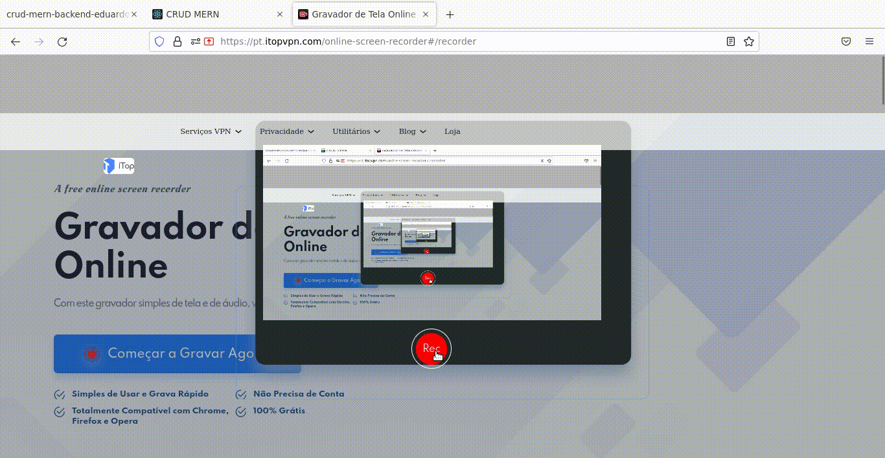

# CRUD MERN
## Apresentação
Olá, esse é um projeto web utilizando CRUD (Create, Read, Update, Delete) que é um acrônimo para as maneiras de se operar em informação armazenada.
## Setup
Utilize os seguinte para instalar
```
npm install
```
Utilize os seguinte para executar
```
npm start
```
## Preview

## Deploy
<a href="https://mern-crud-eduardoddmg.netlify.app/" target="_blank">Clique aqui para acessar o deploy</a>
## Tecnologias utilizadas
* ReactJS
* Context API
## Bibliotecas utilizadas
* Material Design
* Axios
* React-Router Dom
* Validator

## Contato
Email: eduardoddmg@gmail.com<br>
Whatsapp: +55 (82) 996038479


